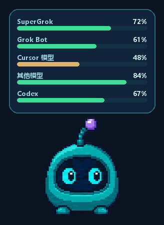

# Grok 额度桌宠

**Grok usage desktop pet** · [中文](#安装) · [English](#install)

<p align="center">
  
</p>

Windows 上的非官方额度桌宠，用来看 SuperGrok 周额度、Grok Bot 周额度、Cursor 月额度，以及 Codex 余量。不是 xAI、Cursor 或 OpenAI 官方软件。程序代码是 MIT；角色素材见 [ASSETS_NOTICE.md](ASSETS_NOTICE.md)。

更完整的中文说明：[使用说明.txt](使用说明.txt) · [README.zh-CN.md](README.zh-CN.md)

## 安装

当前版本：**0.3.9**（`v0.3.9`）。

从 [GitHub Release](https://github.com/MGMTopia/grok-usage-pet/releases/latest) 下载 **`GrokUsagePet-v0.3.9-Windows-x64.zip`**。不必装 Python。

1. 解压**整个文件夹**，不要只拷贝 exe。
2. 本机先登录一次（登哪个就显示哪条）：
   - SuperGrok：`grok login`
   - Grok Bot / Cursor：在 Cursor 里登录
   - Codex：ChatGPT 套餐的 `codex login`（不要用纯 API Key）
3. 双击 `GrokUsagePet.exe`。

Windows 10/11。未签名，SmartScreen 可能要选「仍要运行」。数据在 `%LOCALAPPDATA%\GrokUsagePet`。设置 → 卸载，或 `--uninstall`，只清本机集成，不动 Grok / Cursor / Codex 登录。

## Install

Unofficial overlay for SuperGrok weekly, Grok Bot weekly, Cursor monthly, and Codex quota. Not an xAI, Cursor, or OpenAI product.

Download **`GrokUsagePet-v0.3.9-Windows-x64.zip`** from the
[latest GitHub Release](https://github.com/MGMTopia/grok-usage-pet/releases/latest).
Python is not required.

1. Unzip the **whole folder**. Do not copy only the exe.
2. Sign in to at least one source (`grok login`, Cursor, or ChatGPT-plan `codex login`).
3. Double-click `GrokUsagePet.exe`.

Windows 10/11. The build is unsigned, so SmartScreen may ask you to run it anyway.

## Run from source

```text
pythonw pet.py
```

Fetching does not require Grok Build, Cursor, or Codex to be running. SuperGrok and ChatGPT-login Codex sessions can refresh their local OAuth credentials when needed; API-key Codex mode has no subscription quota percentage.

## Test

Tests do not open Tk, use the network, or read real Grok/Cursor credentials.

```powershell
powershell -NoProfile -ExecutionPolicy Bypass -File .\run-tests.ps1
```

## Build the Windows release

The verified toolchain is Python 3.12, Pillow 12.3.0, PyInstaller 6.22.2, and pyinstaller-hooks-contrib 2026.7. Most people should use the Release zip above instead of compiling.

```powershell
python -m pip install --require-hashes -r requirements-build.lock
powershell -NoProfile -ExecutionPolicy Bypass -File .\pack-windows.ps1
```

`GrokUsagePet.spec` is the single source of truth for PyInstaller resources. The packaging script runs tests, builds the executable, runs smoke tests, checks required skins and sensitive content, includes exact third-party license files, and creates a versioned ZIP with SHA256 verification. GitHub release builds also publish a verifiable provenance attestation.

For a deterministic GUI lifecycle check without credentials or network access:

```powershell
.\dist\GrokUsagePet\GrokUsagePet.exe --visual-smoke-test
```

The preview renders fixed sample quotas and exits after three seconds without saving state.

## Packs in `release/`

| Zip | What |
|-----|------|
| `GrokUsagePet-v0.3.9-Windows-x64.zip` | Current release (`GrokUsagePet.exe`). Rebuild with `pack-windows.ps1`. |
| `GrokUsagePet-kawaii.zip` | Legacy v0.2.0 compatibility archive; not the current release. |

Do not copy `auth.json`, Cursor `state.vscdb`, or `pet_state.json` into a zip.

## Snapshot contract

- `complete`: at least one configured source returned usable quota data.
- `partial`: retained for compatibility with older snapshots.
- `failed`: neither source returned usable data. The previous usable snapshot is retained.
- CLI exit codes: `0` for complete/partial, `1` for failed, and `2` for an internal error.

## Layout

- `pet.py` — Tk controller, animation, and quota bubble
- `fetch_usage.py` — Grok/Cursor/Codex fetching and aggregation
- `usage_model.py` — pure snapshot status and text formatting
- `snapshot_store.py` — atomic public snapshot persistence
- `cursor_hooks.py` — safe shared Cursor hook management
- `skin_catalog.py` — skin discovery and manifest defaults
- `pet_view_model.py` — pure UI quota mapping
- `app_update.py` — GitHub Release check and verified zip install
- `tests/` — offline unit and smoke tests
- `skins/megumi-kato/` — complete example skin
- `skins/original/` — complete default Original/Pip skin
- `packaging/windows/` — portable launcher and watcher registration files
- `docs/preview.gif` — README animation, regenerated with `docs/make_preview_gif.py`

Version changes are recorded in [CHANGELOG.md](CHANGELOG.md). Code licensing is in [LICENSE](LICENSE), packaged dependency terms are in [THIRD_PARTY_NOTICES.md](THIRD_PARTY_NOTICES.md), and artwork redistribution boundaries are documented separately.

## Feedback and contributions

Use this GitHub repository's **Issues**, **Discussions**, and **Security advisories** tabs. Do not paste tokens or quota snapshots.

Before posting, remove email addresses, tokens, `auth.json`, `state.vscdb`, quota snapshots, and full logs. See [CONTRIBUTING.md](CONTRIBUTING.md) for the project scope and test requirements.
